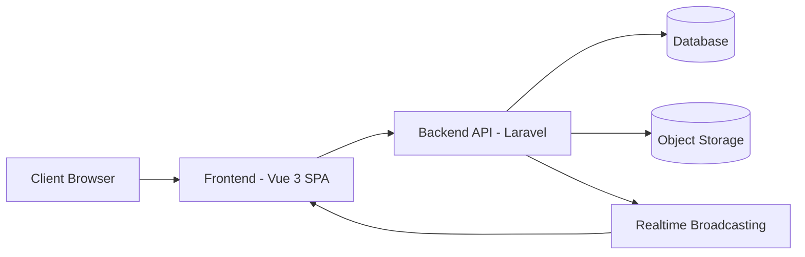
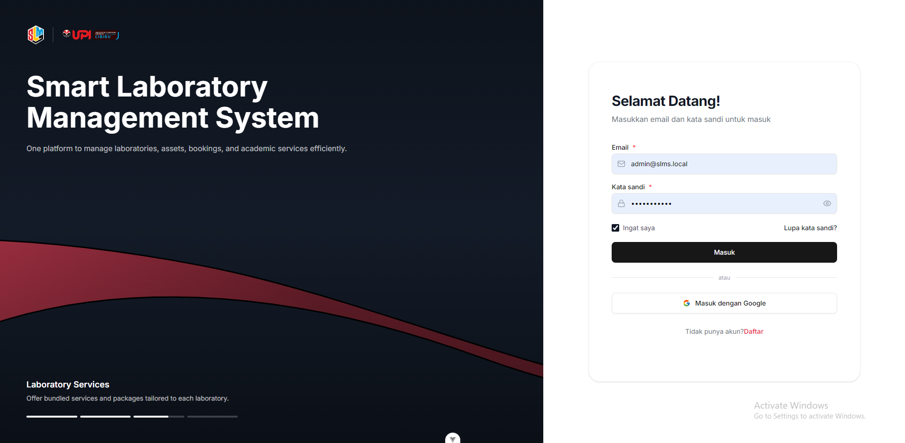
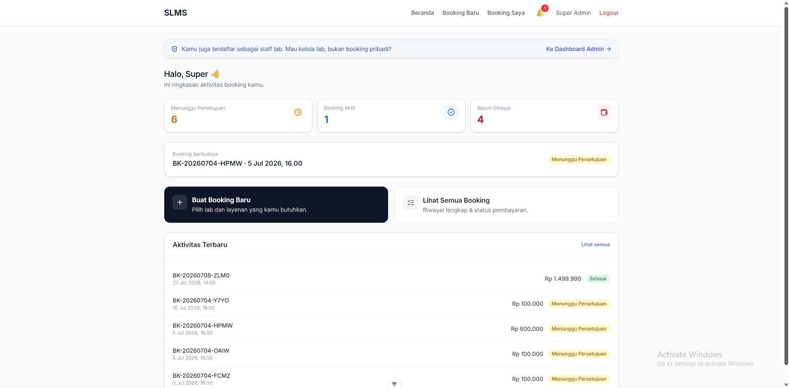
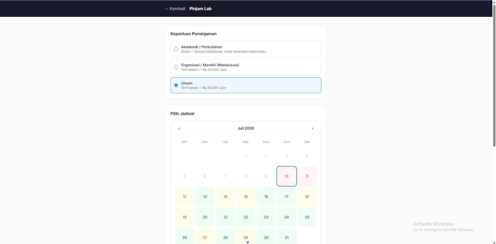
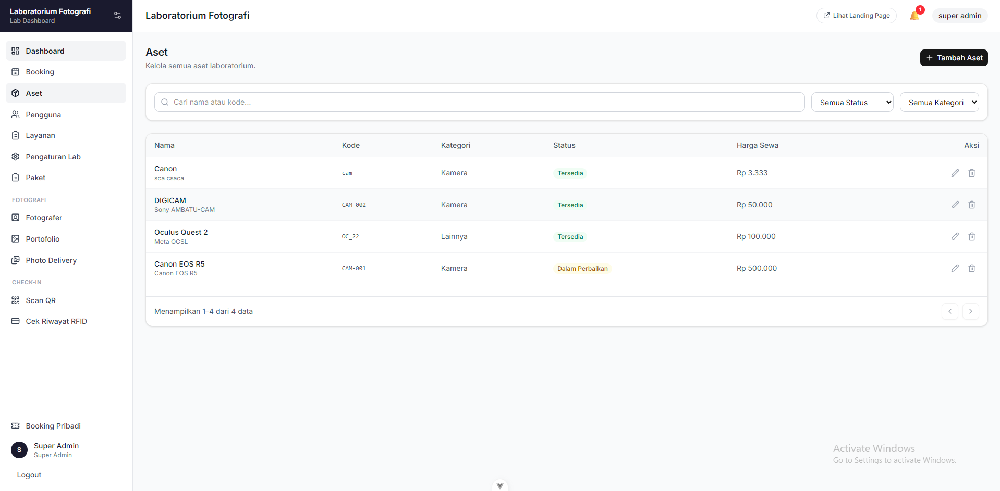
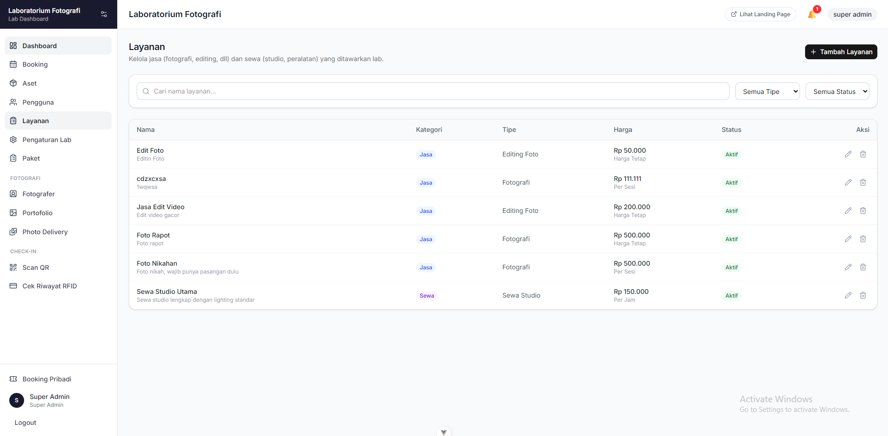
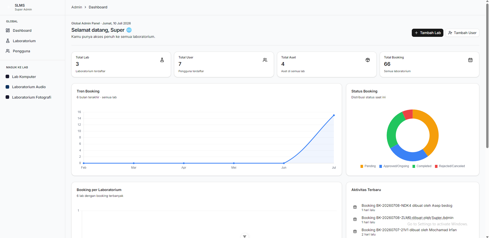

## SLMS — Smart Laboratory Management System

<p align="center">
  <strong>Platform terpadu untuk mengelola laboratorium, aset, booking, dan layanan akademik secara efisien.</strong>
</p>

<p align="center">
  
  
  
  
</p>

---

## 📖 Project Description

**SLMS (Smart Laboratory Management System)** adalah platform manajemen laboratorium multi-tenant yang dirancang untuk institusi pendidikan maupun unit usaha yang mengelola beberapa laboratorium sekaligus (misalnya lab fotografi, lab komputer, studio, dll).

Proyek ini dikembangkan sebagai **Tugas Akhir (Skripsi)** dan direncanakan untuk diterapkan di **Universitas Pendidikan Indonesia (UPI) Kampus Cibiru** guna mendukung pengelolaan laboratorium secara digital dan terpusat.

### 🎯 Tujuan

Menyediakan satu sistem terpusat untuk mengelola booking, aset, layanan, dan pengguna di berbagai laboratorium - masing-masing dengan branding dan konfigurasi sendiri.

### 🧩 Masalah yang Diselesaikan

- Proses booking laboratorium/peralatan yang masih manual
- Sulitnya melacak ketersediaan aset dan jadwal penggunaan lab
- Tidak adanya sistem terpadu untuk layanan tambahan (jasa fotografi, editing, dsb.)
- Manajemen akses pengguna yang berbeda-beda di tiap lab

### 👥 Target Pengguna

- Admin pusat (Super Admin) yang mengawasi seluruh laboratorium
- Admin/Staff tiap laboratorium (Lab Admin, Operator, Photographer, Editor)
- Mahasiswa/pengguna umum yang melakukan booking layanan atau sewa alat

### 🔭 Ruang Lingkup

Sistem mencakup landing page publik per-lab, alur booking (pinjam lab, sewa alat, jasa & paket), manajemen aset, layanan tambahan (termasuk delivery hasil foto), serta panel administrasi multi-level.

### 🏫 Studi Kasus Implementasi

Sistem ini direncanakan untuk diimplementasikan di lingkungan **UPI Kampus Cibiru**, sebagai bagian dari upaya digitalisasi pengelolaan laboratorium kampus.

---

## ✨ Features

- 🔐 **Authentication & Authorization** — login, register, verifikasi email, reset password
- 🏢 **Multi-Laboratory Management** — kelola banyak lab dalam satu platform
- 📦 **Asset Management** — pencatatan dan status peralatan lab
- 📅 **Booking System** — booking lab, sewa alat, dan jasa/paket layanan
- 🛎️ **Service & Package Management** — layanan satuan maupun bundling
- 📊 **Dashboard & Analytics** — ringkasan aktivitas per lab maupun global
- 👤 **User Management** — pengelolaan akun dan akses multi-role
- 🎨 **Dynamic Branding** — tiap lab punya warna, logo, dan tampilan sendiri
- 🛡️ **Role & Permission** — kontrol akses granular berbasis role
- 📱 **Responsive UI** — dapat diakses dari desktop maupun mobile
- 🖼️ **Photo Delivery Workflow** — alur pemilihan & pengiriman hasil foto (untuk lab fotografi)
- 🔔 **Realtime Notification** — notifikasi pembaruan status secara langsung
- 💳 **Payment Gateway Integration** — pembayaran online untuk booking berbayar
- 🪪 **RFID Check-in** — dukungan check-in otomatis via kartu RFID

---

## 🛠️ Technology Stack

| Kategori             | Teknologi                                                                |
| -------------------- | ------------------------------------------------------------------------ |
| **Frontend**         | Vue 3, TypeScript, Vite, Tailwind CSS, Pinia, Vue Router, TanStack Query |
| **Backend**          | Laravel (PHP), Domain-Driven Folder Structure                            |
| **Database**         | Relasional (MySQL/PostgreSQL kompatibel)                                 |
| **Docker**           | Containerized development environment                                    |
| **Authentication**   | Laravel Sanctum (token-based)                                            |
| **State Management** | Pinia (frontend)                                                         |
| **UI Framework**     | Tailwind CSS + komponen custom (shadcn-style)                            |
| **Storage**          | S3-compatible Object Storage (MinIO)                                     |
| **Realtime**         | Laravel Reverb (WebSocket broadcasting)                                  |
| **Payment**          | Midtrans Payment Gateway                                                 |

---

## 🏗️ Architecture Overview

Gambaran umum alur data pada sistem:



> Arsitektur bersifat **modular per-domain** di sisi backend dan **feature-based** di sisi frontend, memungkinkan pengembangan fitur baru secara terisolasi.

---

## 📂 Folder Structure

Struktur direktori tingkat atas project:

```
├── frontend/       # Aplikasi Vue 3 (SPA)
├── backend/        # Aplikasi Laravel (REST API)
├── docker/         # (jika ada) konfigurasi container
└── docs/           # Dokumentasi tambahan & screenshots
```

Frontend disusun berbasis **fitur** (feature-based), sedangkan backend disusun berbasis **domain** (domain-driven), untuk memudahkan skalabilitas dan pemeliharaan jangka panjang.

---

## ⚙️ Installation

Project ini menggunakan **Docker Compose** untuk seluruh service (backend, frontend, database, queue, storage, dsb.) sehingga proses setup tidak memerlukan instalasi PHP/Node/Postgres secara manual di komputer.

### Prasyarat

- [Docker](https://www.docker.com/) & Docker Compose
- `make` (biasanya sudah tersedia di Linux/macOS; untuk Windows gunakan WSL atau Git Bash)

### 🚀 Cara Cepat (Direkomendasikan)

```bash
# 1. Clone repository
git clone https://github.com/fanhdt/slms.git
cd slms

# 2. Jalankan setup otomatis
make setup
```

Perintah `make setup` akan otomatis:

1. Menyalin `.env.example` menjadi `.env`
2. Build seluruh image Docker
3. Menjalankan semua service (`docker compose up -d`)
4. Generate application key Laravel
5. Menjalankan migrasi database beserta seeder
6. Menginstall dependencies frontend

Setelah selesai, aplikasi dapat diakses melalui:

| Layanan                 | URL                   |
| ----------------------- | --------------------- |
| Aplikasi (Nginx)        | http://localhost      |
| Mailpit (Email Testing) | http://localhost:8025 |
| MinIO Console (Storage) | http://localhost:9001 |

### 🛠️ Perintah Umum Lainnya

Project ini menyediakan `Makefile` untuk mempermudah operasional sehari-hari:

```bash
make up               # Menjalankan seluruh service
make down             # Menghentikan seluruh service
make restart          # Rebuild & restart seluruh service
make logs             # Melihat log seluruh service
make logs-backend     # Melihat log backend, worker, dan scheduler

make shell-backend    # Masuk ke shell container backend
make shell-frontend   # Masuk ke shell container frontend
make shell-postgres   # Masuk ke psql container database

make migrate          # Menjalankan migrasi database
make seed             # Menjalankan database seeder
make fresh            # Migrasi ulang dari awal + seeding

make test             # Menjalankan test backend
make lint-backend     # Menjalankan linting PHP (Pint)
make lint-frontend    # Menjalankan linting frontend

make artisan cmd="..."   # Menjalankan perintah artisan apa pun
make npm cmd="..."       # Menjalankan perintah npm apa pun di frontend
```

> Jalankan `make help` kapan pun untuk melihat daftar lengkap perintah yang tersedia.

### 🔧 Setup Manual (Alternatif)

Jika tidak menggunakan `make`, langkah yang sama dapat dijalankan manual:

```bash
cp .env.example .env
docker compose build
docker compose up -d
docker compose exec backend php artisan key:generate
docker compose exec backend php artisan migrate --seed
docker compose exec frontend npm install
```

---

## 📐 System Design

Dokumentasi perancangan sistem tersedia pada folder `docs/diagrams/`:

- 🔄 Flowchart Alur Sistem
- 🧑‍💻 Use Case Diagram

> Diagram teknis lain (ERD, DFD) merupakan bagian dari dokumentasi
> akademik skripsi dan tidak dipublikasikan secara detail di README ini
> untuk menjaga keamanan struktur data sistem.

---

## 📸 Screenshots

> Tangkapan layar aktual disimpan pada folder `docs/screenshots/`.

| Halaman           | Preview                                            |
| ----------------- | -------------------------------------------------- |
| Login             |              |
| Dashboard         |      |
| Booking           |          |
| Asset Management  |              |
| Service & Package |          |
| Admin Panel       |  |

---

## 🧩 Project Modules

| Modul                 | Deskripsi Singkat                             |
| --------------------- | --------------------------------------------- |
| **Authentication**    | Login, registrasi, verifikasi, reset password |
| **Dashboard**         | Ringkasan statistik & aktivitas lab           |
| **Laboratory**        | Pengelolaan data & branding tiap laboratorium |
| **Asset**             | Manajemen inventaris peralatan lab            |
| **Booking**           | Alur pemesanan lab, alat, dan layanan         |
| **Service & Package** | Katalog jasa dan paket bundling               |
| **Photo Delivery**    | Alur pengiriman hasil foto ke customer        |
| **User Management**   | Pengelolaan akun dan hak akses                |
| **Notification**      | Pemberitahuan realtime untuk pengguna         |
| **Report**            | 📌 _Planned Feature_                          |
| **Settings**          | Konfigurasi umum sistem dan lab               |

---

## 🚦 Development Status

### ✅ Completed

- Autentikasi & manajemen akun
- Manajemen multi-lab dengan branding dinamis
- Booking (lab, alat, jasa/paket)
- Manajemen aset dan layanan
- Dashboard admin (global & per-lab)
- Notifikasi realtime
- Integrasi pembayaran online
- Alur delivery foto untuk lab fotografi
- Check-in via RFID & QR Code

### 🚧 In Progress

- Peningkatan modul pelaporan (Report)
- Optimasi tampilan dashboard analitik

### 📌 Planned

- Ekspor laporan (PDF/Excel)
- Integrasi kalender eksternal
- Modul rating & review layanan
- Multi-bahasa (i18n)

---

## 🗺️ Roadmap

- [ ] Modul **Reporting & Analytics** lanjutan
- [ ] Dukungan **multi-bahasa**
- [ ] **Mobile-friendly PWA**
- [ ] Sistem **rating & feedback** customer
- [ ] Integrasi **payment gateway** tambahan
- [ ] Audit log yang lebih komprehensif

---

## 📄 License

Proyek ini dikembangkan sebagai bagian dari **Tugas Akhir (Skripsi)**
di **Universitas Pendidikan Indonesia (UPI) Kampus Cibiru**.

Hak cipta kode sumber ini dimiliki oleh penulis dan digunakan untuk
keperluan akademik. Penggunaan, modifikasi, atau distribusi ulang
kode ini untuk kepentingan di luar akademik memerlukan izin tertulis
dari penulis.

**Copyright © 2026 Mochamad Irfan Hidayat. All Rights Reserved.**

> Proyek ini dipublikasikan sebagai bagian dari dokumentasi akademik
> dan portofolio, bukan untuk tujuan komersial.

---

## 👤 Author

**Mochamad Irfan Hidayat**
📧 Email: mochamadirfan0211@gmail.com
🔗 GitHub: [@fanhdt](https://github.com/fanhdt)
🏫 Universitas Pendidikan Indonesia — Kampus Cibiru

---

<p align="center">yang patah dan hilang semangatnya, yang tumbuh dan berganti cuma error-nya</p>
<p align="center">akhirnya beres</p>
