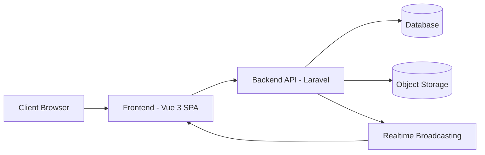

# 🧪 SLMS — Smart Laboratory Management System

<p align="center">
  <strong>Platform terpadu untuk mengelola laboratorium, aset, booking, dan layanan akademik secara efisien.</strong>
</p>

<p align="center">
  
  
  
  
</p>

---

## 📖 Project Description

**SLMS (Smart Laboratory Management System)** adalah platform manajemen laboratorium multi-tenant yang dirancang untuk institusi pendidikan maupun unit usaha yang mengelola beberapa laboratorium sekaligus (misalnya lab fotografi, lab komputer, studio, dll).

### 🎯 Tujuan

Menyediakan satu sistem terpusat untuk mengelola booking, aset, layanan, dan pengguna di berbagai laboratorium — masing-masing dengan branding dan konfigurasi sendiri.

### 🧩 Masalah yang Diselesaikan

- Proses booking laboratorium/peralatan yang masih manual
- Sulitnya melacak ketersediaan aset dan jadwal penggunaan lab
- Tidak adanya sistem terpadu untuk layanan tambahan (jasa fotografi, editing, dsb.)
- Manajemen akses pengguna yang berbeda-beda di tiap lab

### 👥 Target Pengguna

- Admin pusat (Super Admin) yang mengawasi seluruh laboratorium
- Admin/Staff tiap laboratorium (Lab Admin, Operator, Photographer, Editor)
- Mahasiswa/pengguna umum yang melakukan booking layanan atau sewa alat

### 🔭 Ruang Lingkup

Sistem mencakup landing page publik per-lab, alur booking (pinjam lab, sewa alat, jasa & paket), manajemen aset, layanan tambahan (termasuk delivery hasil foto), serta panel administrasi multi-level.

---

## ✨ Features

- 🔐 **Authentication & Authorization** — login, register, verifikasi email, reset password
- 🏢 **Multi-Laboratory Management** — kelola banyak lab dalam satu platform
- 📦 **Asset Management** — pencatatan dan status peralatan lab
- 📅 **Booking System** — booking lab, sewa alat, dan jasa/paket layanan
- 🛎️ **Service & Package Management** — layanan satuan maupun bundling
- 📊 **Dashboard & Analytics** — ringkasan aktivitas per lab maupun global
- 👤 **User Management** — pengelolaan akun dan akses multi-role
- 🎨 **Dynamic Branding** — tiap lab punya warna, logo, dan tampilan sendiri
- 🛡️ **Role & Permission** — kontrol akses granular berbasis role
- 📱 **Responsive UI** — dapat diakses dari desktop maupun mobile
- 🖼️ **Photo Delivery Workflow** — alur pemilihan & pengiriman hasil foto (untuk lab fotografi)
- 🔔 **Realtime Notification** — notifikasi pembaruan status secara langsung
- 💳 **Payment Gateway Integration** — pembayaran online untuk booking berbayar
- 🪪 **RFID Check-in** — dukungan check-in otomatis via kartu RFID

---

## 🛠️ Technology Stack

| Kategori             | Teknologi                                                                |
| -------------------- | ------------------------------------------------------------------------ |
| **Frontend**         | Vue 3, TypeScript, Vite, Tailwind CSS, Pinia, Vue Router, TanStack Query |
| **Backend**          | Laravel (PHP), Domain-Driven Folder Structure                            |
| **Database**         | Relasional (MySQL/PostgreSQL kompatibel)                                 |
| **Docker**           | Containerized development environment                                    |
| **Authentication**   | Laravel Sanctum (token-based)                                            |
| **State Management** | Pinia (frontend)                                                         |
| **UI Framework**     | Tailwind CSS + komponen custom (shadcn-style)                            |
| **Storage**          | S3-compatible Object Storage (MinIO)                                     |
| **Realtime**         | Laravel Reverb (WebSocket broadcasting)                                  |
| **Payment**          | Midtrans Payment Gateway                                                 |

---

## 🏗️ Architecture Overview

Gambaran umum alur data pada sistem:



> Arsitektur bersifat **modular per-domain** di sisi backend dan **feature-based** di sisi frontend, memungkinkan pengembangan fitur baru secara terisolasi.

---

## 📂 Folder Structure

Struktur direktori tingkat atas project:

```
├── frontend/       # Aplikasi Vue 3 (SPA)
├── backend/        # Aplikasi Laravel (REST API)
├── docker/          # (jika ada) konfigurasi container
└── docs/            # Dokumentasi tambahan
```

Frontend disusun berbasis **fitur** (feature-based), sedangkan backend disusun berbasis **domain** (domain-driven), untuk memudahkan skalabilitas dan pemeliharaan jangka panjang.

---

## ⚙️ Installation

> Panduan instalasi umum. Sesuaikan dengan environment lokal Anda.

### 1. Clone Repository

```bash
git clone https://github.com/username/slms.git
cd slms
```

### 2. Setup Backend

```bash
cd backend
composer install
cp .env.example .env
php artisan key:generate
```

### 3. Jalankan Docker (opsional, untuk service pendukung seperti storage/queue)

```bash
docker compose up -d
```

### 4. Migrasi & Seeder Database

```bash
php artisan migrate
php artisan db:seed
```

### 5. Jalankan Backend

```bash
php artisan serve
```

### 6. Setup & Jalankan Frontend

```bash
cd ../frontend
npm install
cp .env.example .env
npm run dev
```

Akses aplikasi melalui `http://localhost:5173` (frontend) yang terhubung ke API backend.

---

## 📸 Screenshots

> Tambahkan tangkapan layar aktual pada folder `docs/screenshots/` dan sesuaikan path di bawah ini.

| Halaman           | Preview                            |
| ----------------- | ---------------------------------- |
| Login             | `docs/screenshots/login.png`       |
| Dashboard         | `docs/screenshots/dashboard.png`   |
| Booking           | `docs/screenshots/booking.png`     |
| Asset Management  | `docs/screenshots/asset.png`       |
| Service & Package | `docs/screenshots/service.png`     |
| Admin Panel       | `docs/screenshots/admin-panel.png` |

---

## 🧩 Project Modules

| Modul                 | Deskripsi Singkat                             |
| --------------------- | --------------------------------------------- |
| **Authentication**    | Login, registrasi, verifikasi, reset password |
| **Dashboard**         | Ringkasan statistik & aktivitas lab           |
| **Laboratory**        | Pengelolaan data & branding tiap laboratorium |
| **Asset**             | Manajemen inventaris peralatan lab            |
| **Booking**           | Alur pemesanan lab, alat, dan layanan         |
| **Service & Package** | Katalog jasa dan paket bundling               |
| **Photo Delivery**    | Alur pengiriman hasil foto ke customer        |
| **User Management**   | Pengelolaan akun dan hak akses                |
| **Notification**      | Pemberitahuan realtime untuk pengguna         |
| **Report**            | 📌 _Planned Feature_                          |
| **Settings**          | Konfigurasi umum sistem dan lab               |

---

## 🚦 Development Status

### ✅ Completed

- Autentikasi & manajemen akun
- Manajemen multi-lab dengan branding dinamis
- Booking (lab, alat, jasa/paket)
- Manajemen aset dan layanan
- Dashboard admin (global & per-lab)
- Notifikasi realtime
- Integrasi pembayaran online
- Alur delivery foto untuk lab fotografi
- Check-in via RFID & QR Code

### 🚧 In Progress

- Peningkatan modul pelaporan (Report)
- Optimasi tampilan dashboard analitik

### 📌 Planned

- Ekspor laporan (PDF/Excel)
- Integrasi kalender eksternal
- Modul rating & review layanan
- Multi-bahasa (i18n)

---

## 🗺️ Roadmap

- [ ] Modul **Reporting & Analytics** lanjutan
- [ ] Dukungan **multi-bahasa**
- [ ] **Mobile-friendly PWA**
- [ ] Sistem **rating & feedback** customer
- [ ] Integrasi **payment gateway** tambahan
- [ ] Audit log yang lebih komprehensif

---

## 📄 License

Proyek ini dikembangkan sebagai bagian dari **Tugas Akhir (Skripsi)**
di **Universitas Pendidikan Indonesia (UPI)**.

Hak cipta kode sumber ini dimiliki oleh penulis dan digunakan untuk
keperluan akademik. Penggunaan, modifikasi, atau distribusi ulang
kode ini untuk kepentingan di luar akademik memerlukan izin tertulis
dari penulis.

**Copyright © 2026 Mochamad Irfan Hidayat. All Rights Reserved.**

> Proyek ini dipublikasikan sebagai bagian dari dokumentasi akademik
> dan portofolio, bukan untuk tujuan komersial.

## 👤 Author

**Nama Author**
📧 Email: mochamadirfan0211@gmail.com
🔗 GitHub: [@fanhdt](https://github.com/fanhdt)

---

<p align="center">yang patah dan hilang semangatnya, yang tumbuh dan berganti cuma error-nya</p>
<p align="center">akhirnya beres</p>
